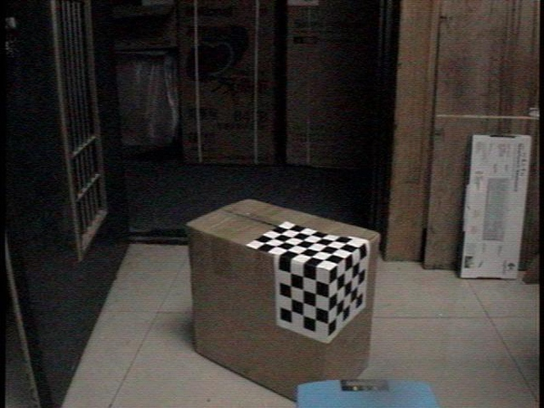

# Ctrl+1

## ctrl+2

### ctrl+3

<u>下划线ctrl+u</u>

~~删除线alt+shift+5~~

**加粗ctrl+b**

*字体倾斜ctrl+i*

- 
- -+space+enter

 

  

  6 数字+enter+space

> 引用ctrl+shift+q

[插入链接ctrl+k](https://blog.csdn.net/cris_zz/article/details/82919401)

ctrl+shft+i插入图片

| ctrl+t |      |      |
| ------ | ---- | ---- |
|        |      |      |
|        |      |      |
|        |      |      |

`哈哈哈`ctrl+shft+·

---

---+enter分割线

==文字==高亮

ddd

~~~python
def mycode:
    print('hello world')
#~~~+enter
~~~

